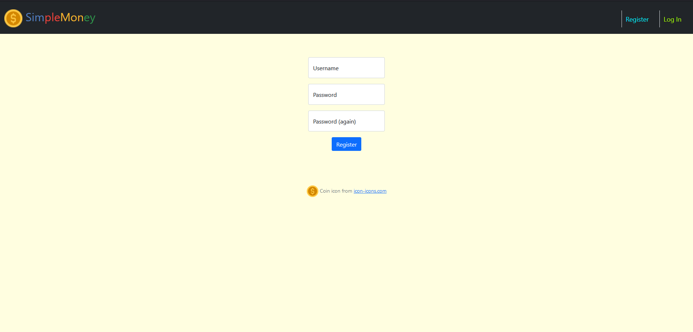
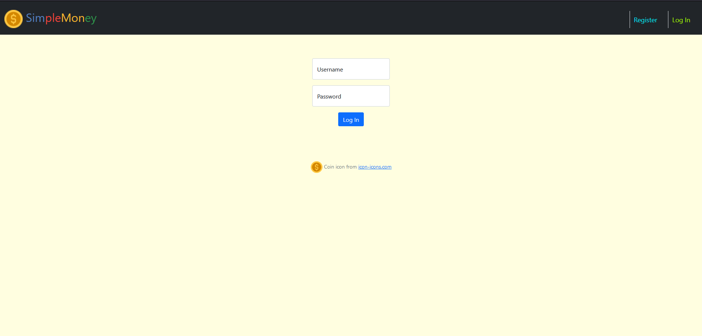
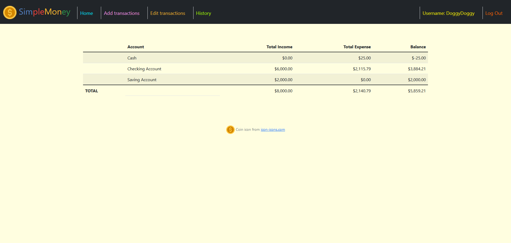
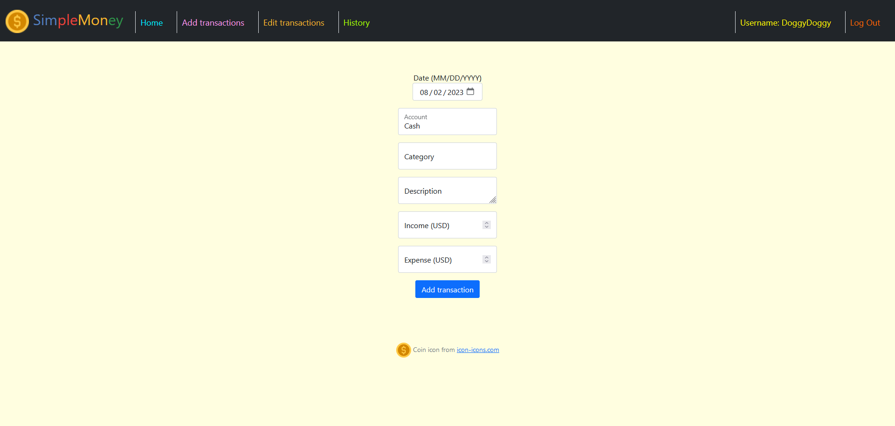
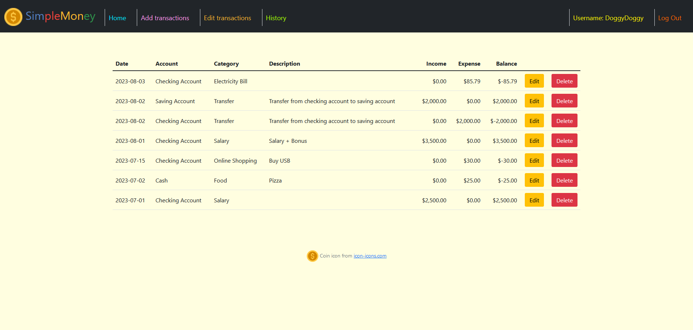

# SimpleMoney

**This is my final project for the course [CS50x Introduction to Computer Science](https://cs50.harvard.edu/x/2023) (by David J. Malan) in 2023.** 

## Overview
- This project is web application named "SimpleMoney".
- It is written using HTML, CSS, JavaScript, Python, SQLite, and Flask  
- The main feature of this application is to track users' incomes and expenses.

## Requirements
- [Flask](https://flask.palletsprojects.com)
  - Flask is a micro-framework written in Python for web application development. 
- [SQLite](https://www.sqlite.org)
  - SQLite is a library that implements a small, fast, self-contained, high-reliability, full-featured, SQL database engine.

## Database
- All data on users and transactions are stored in the database file "database.db"
- Data are managed by using SQLite3.
- The database contains 2 main tables described by the following schema:
  1. CREATE TABLE users (
      id INTEGER PRIMARY KEY AUTOINCREMENT NOT NULL,
      username TEXT NOT NULL,
      hash TEXT NOT NULL);
     CREATE UNIQUE INDEX username ON users (username);
  2. CREATE TABLE transactions (
      id INTEGER PRIMARY KEY AUTOINCREMENT NOT NULL,
      user_id INTEGER,
      date DATE,
      account     TEXT,
      category TEXT,
      description TEXT,
      income      REAL NOT NULL DEFAULT 0.00,
      expense     REAL NOT NULL DEFAULT 0.00,
      FOREIGN KEY(user_id) REFERENCES users(id)
      );
  3. CREATE TABLE sqlite_sequence(name,seq);
- The table "sqlite_sequence" is automatically created to store information about autoincrement column.

## How to use

### 1. Register
- To use this web app, you first need to create your own account.
- To register, click the "Register" link in the navigation bar at the top of the page.
- Fill in your username, password and password confirmation. 
- The password must contain at least one digit (0-9) and one special character (#, ?, !, @, $, %, ^, &, *, -, _)
- Then click the "register" link.
- If your registration is successful, you will be redirected to the index page (or home page) with a flash message saying that your registration is complete.  

### 2. Log in and log out
- To log in, fill in your username and password, and then click the "Log In" button.
- After you have logged in, your username will appear in the top navigation bar
- To log out, click the "Log Out" link in the top navigation bar.

### 3. Home page
- To go to your home page, click the "Home" link in the top navigation bar.
- Your home page contains a summary table that shows your total income, total expense, and balance for each of your account. 

### 4. Add transactions
- To add a transaction, click the "Add transactions" link in the top navigation bar.
- The form consists of date, account, category, description, income (USD), and expense (USD) 
- Date, account, and either income or expense are required. The other fields are optional. 
- After filling in the form, click the "Add transaction" button.
- If the transaction has been successfully added, you will be redirected to your home page with a flash message.

### 5. Edit transactions
- To edit a transaction, click the "Edit transactions" link in the top navigation bar.
- Choose the transaction you want to edit.
- If you want to edit the information of the transaction, click the "Edit" button in the that transaction's row. Then change the information and click the "Edit transaction" button.
- If you want to delete the transaction, click the "Delete" button in the that transaction's row. A confirmation popup box will appear. Click the "OK" button to confirm that you want to delete that transaction.

### 6. History
- To see your transaction history, click the "History" link in the top navigation bar.
- The history page will show all of your past transaction information.

## Demonstration on youtube
I made a short video to present my final project:
???

## References, documentation, and some useful resources
- CS50's Introduction to Computer Science
    https://www.harvardonline.harvard.edu/course/cs50-introduction-computer-science
- GitHub
    https://github.com
- Bootstrap
    https://getbootstrap.com
- Flask
    https://flask.palletsprojects.com
- SQLite Documentation
    https://www.sqlite.org/docs.html
- W3Schools 
    https://www.w3schools.com
- Python SQLite Tutorial: Complete Overview - Creating a Database, Table, and Running Queries 
    https://www.youtube.com/watch?v=pd-0G0MigUA
- SQLite Databases With Python - Full Course 
    https://www.youtube.com/watch?v=byHcYRpMgI4
